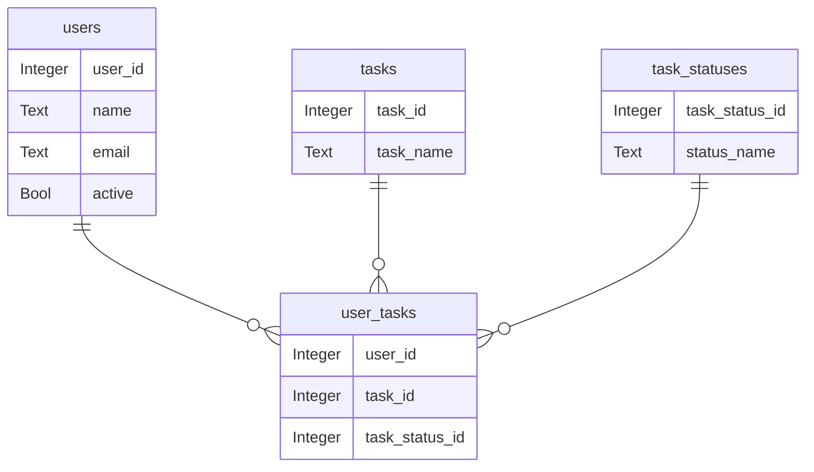

# Rust + Diesel + SQLite Example (Code-First)

I'm strongly recommending Bash for `Windows device users`. You will encounter encoding issues with Diesel_Ext command if you use Windows CMD or PowerShell when using Diesel_Ext command.  Rust requires that all code files are using UTF8 encoding. I've also notice other cosmetic issues that you will want to avoid.   

For `Mac users`, it is my understanding that applications installed by Homebrew should automatically be added to the PATH.  You can review my Windows + Bash list below to confirm.  It might be a good idea to append them to the end of your ~/.zsh profile for good measure. 

For `Windows + Bash users`, I currently have instructions to add environment variables and aliases as you need them in the intructions.  This was due to me stepping through the process and documenting. Below is a complete list of variables and aliases that are used in Steps 1 through 3. I do not think there is a reason all cannot be configured up front. Regardless of what you do, after completing Step 3, open you shell profile and compare the variables and aliases to the following list.  If a variable appears more than once, then the last variable assignment wins.  That being said, it is not uncommon to see the PATH variable being set more than once, but each time the new folder path is append/prepend to the existing list of folder paths in the PATH.  

For `Windows + Bash users`, I recommend changing your default terminal to Bash.
1. CTRL+SHIFT+P   to open command pallet
2. Search for `Terminal: Select Default Profile`
3. Select `Git Bash` from the choices
4. Close all open terminals in VS Code
5. Open a new terminal  `CTRL+SHIFT+BackTick`
6. Bash terminal should have opened

## List of all environment variables and aliases for Windows + Bash that should be in your ~/.bashrc
```bash
export CARGO_ROOT="/c/Users/**<YOUR USERNAME>**/.cargo"
export VCPKG_ROOT="/c/vcpkg"
export SQLITE3_LIB_DIR="$VCPKG_ROOT/installed/x64-windows/lib/"          # sqlite3.lib
export SQLITE3_INCLUDE_DIR="$VCPKG_ROOT/installed/x64-windows/include/"  # sqlite3.h
export PATH="$VCPKG_ROOT:$VCPKG_ROOT/installed/x64-windows/bin/:$PATH"
alias vcpkg='/c/vcpkg/vcpkg.exe'
alias cargo='/c/Users/**<YOUR USERNAME>**/.cargo/bin/cargo.exe'
alias sqlite3='/c/sqlite/sqlite.exe'
alias diesel="$CARGO_ROOT/bin/diesel.exe"
alias diesel_ext="$CARGO_ROOT/bin/diesel_ext.exe"
```

The most critical piece of the setup is that are required software is installed.  If you are having trouble getting environment variables or aliases to work, please use these work arounds until we identify the root cause of these issues.

Set problematic environment variables immediately before calling vcpkg, diesel, or diesel_ext commands.

If your shell cannot find the commands, the use fully qualified path to commands. 

Obviously, you would need to supply your own correct paths.  In other words, visually confirm the correct paths.

```bash
export VCPKG_ROOT="/c/vcpkg"
export SQLITE3_LIB_DIR="$VCPKG_ROOT/installed/x64-windows/lib/"          
export SQLITE3_INCLUDE_DIR="$VCPKG_ROOT/installed/x64-windows/include/"
diesel migration generation --diff-schema initial_migration
diesel migration run
cargo run
```


## Step 1: Create library crate
```powershell
cargo new --lib diesel_app
cd diesel_app
code .
```

## Step 2: Add Dependencies

```powershell
cargo add diesel --features diesel/sqlite,diesel/returning_clauses_for_sqlite_3_35
cargo add dotenvy
cargo add serde --features derive
cargo add serde_json
cargo add anyhow
```

---

## Step 3: Set Up Diesel CLI and Configuration

1. **Install vcpkg - C++ package manager**
```powershell
# Windows + powershell
cd C:\
git clone https://github.com/microsoft/vcpkg
cd vcpkg
.\bootstrap-vcpkg.bat

# Windows + Bash
# You must **POWERSHELL** for this step 
cd C:\
git clone https://github.com/microsoft/vcpkg
cd vcpkg
.\bootstrap-vcpkg.bat
# Switch to Bash to create alias for vcpkg
echo "alias vcpkg='/c/vcpkg/vcpkg.exe'" >> ~/.bashrc
source ~/.bashrc

# Mac
cd ~
git clone https://github.com/microsoft/vcpkg.git
cd vcpkg
./bootstrap-vcpkg.sh
```

2. **Install sqlite using vcpkg - will install Diesel dependencies**
```powershell
# Windows
cd c:\vcpkg
.\vcpkg.exe install sqlite3:x64-windows

# Windows + Bash
# use **POWERSHELL** to install sqlite
cd c:\vcpkg
.\vcpkg.exe install sqlite3:x64-windows

# Mac
cd ~/vcpkg
./vcpkg install sqlite3:x64-osx
```

3. **Install SQLite3 binaries**
```powershell
   # Windows + Powershell: - select ****ONE**** of these options
         # Winget  -- default location is C:\Program Files\SQLite
            winget install --id=SQLite.sqlite --source=winget
            # Create C:\sqlite if it does not exist
            if (!(Test-Path -Path "C:\sqlite")) {
               New-Item -ItemType Directory -Path "C:\sqlite"
            }
            # Copy Sqlite3.exe to C:\sqlite
            Copy-Item "C:\Program Files\SQLite\sqlite3.exe" "C:\sqlite\"

         # Chocolately - default location is C:\ProgramData\chocolatey\lib\sqlite\tools
            choco install sqlite
            # Create C:\sqlite if it does not exist
            if (!(Test-Path -Path "C:\sqlite")) {
               New-Item -ItemType Directory -Path "C:\sqlite"
            }
            # Copy Sqlite3.exe to C:\sqlite
            Copy-Item "C:\ProgramData\chocolatey\lib\sqlite\tools\sqlite3.exe" "C:\sqlite\sqlite3.exe"

         # Scoop -  default location is C:\Users\<your-username>\scoop\apps\sqlite\current\
            scoop install sqlite
            # Create C:\sqlite if it does not exist
            if (!(Test-Path -Path "C:\sqlite")) {
               New-Item -ItemType Directory -Path "C:\sqlite"
            }
            # Copy Sqlite3.exe to C:\sqlite
           Copy-Item "C:\Users\**<YOUR-USERNAME>**\scoop\apps\sqlite\current\sqlite3.exe" "C:\sqlite\sqlite3.exe"
         
         # Manually  
            # - Go to SQLite Download Page: https://www.sqlite.org/download.html
            # - Scroll down until you see Precompiled Binaries for Windows
            # - Download SQLite tools version for you OS:  e.g. sqlite-tools-win64-x86-xxxxxx.zip
            # - Extract zip file
            # - Create `C:\sqlite` folder and move extracted binary tools inside of this folder
            # - Add `C:\sqlite` to your PATH environment variable

   # Windows + Bash
      # **FOLLOW WINDOWS** instructions above

   # Mac:
         # Install Homebrew, if not already installed
          /bin/bash -c "$(curl -fsSL https://raw.githubusercontent.com/Homebrew/install/HEAD/install.sh)"
         # Install SQLite using Homebrew
         brew install sqlite
```
4. Verify that sqlite3 was installed successfully   
   ```powershell
      # Windows + PowerShell
         sqlite3  --version

      # Windows + Bash
         echo "alias sqlite3='/c/sqlite/sqlite3.exe'" >> ~/.bashrc
         source ~/.bashrc
         sqlite3  --version

      # Mac     
         sqlite3  --version
   ```

5. **Set the environment variable in PowerShell**
   ```powershell
   # Windows + PowerShell
      # You can execute these commands in Powershell, but they will not be persistent.
      # If you want them to be persistent, then execute `notebook $profile`, copy/past the four
      # commands below into the $profile text file that Notebook opened and save.
   	$env:VCPKG_ROOT="C:\vcpkg"	       # vcpkg install location
      $env:SQLITE3_LIB_DIR = "$env:VCPKG_ROOT\installed\x64-windows\lib"            # sqlite3.lib
      $env:SQLITE3_INCLUDE_DIR = "$env:VCPKG_ROOT\installed\x64-windows\include" 	# sqlite3.h
      $env:PATH += ";$env:VCPKG_ROOT;$env:VCPKG_ROOT\installed\x64-windows\bin;C:\sqlite"

      # Force current shell to load updated environment
	   . $profile
   
   # Windows + bash shell
      # You can execute these commands in your shell, but they will not be persistent
      # If you want them to be persistent, then execute `nano ~/.bashrc`, copy/past the four 
      # commands at the end of your shell profile (~/.bashrc) and save. CTRL+O, ENTER, CTRL+X

      export VCPKG_ROOT="/c/vcpkg"
      export SQLITE3_LIB_DIR="$VCPKG_ROOT/installed/x64-osx/lib/"          # sqlite3.lib
      export SQLITE3_INCLUDE_DIR="$VCPKG_ROOT/installed/x64-osx/include/"  # sqlite3.h
      export PATH=":$VCPKG_ROOT:$VCPKG_ROOT/installed/x64-osx/bin/:$PATH"

      source ~/.bashrc 


   # Mac 
      # You can execute these commands in your shell, but they will not be persistent
      # If you want them to be persistent, then execute `nano ~/.zshrc`, copy/past the four 
      # commands at the end of your shell profile and save. CTRL+O, ENTER, CTRL+X  
      export VCPKG_ROOT="$HOME/vcpkg"                                      # vcpkg install location
      export SQLITE3_LIB_DIR="$VCPKG_ROOT/installed/x64-osx/lib/"          # sqlite3.lib
      export SQLITE3_INCLUDE_DIR="$VCPKG_ROOT/installed/x64-osx/include/"  # sqlite3.h
      export PATH="$PATH:$VCPKG_ROOT:$VCPKG_ROOT/installed/x64-osx/bin/"   
 
       # Force current shell to load updated environment
	   source ~/.zshrc  

   ```

6. **Install Diesel CLI with SQLite support**
   ```powershell
   cargo install cargo-binstall
   cargo binstall diesel_cli 

   # add diesel cli to your path

   # confirm diesel cli is installed
   diesel --version
   ```

7. **Install Diesel_ext for auto generating models**
```powershell
   cargo binstall diesel_cli_ext

   # add diesel_ext cli to your path
   
   # confirm diesel_ext cli is installed
   diesel_ext -h
```

8. **Run Diesel Setup**
```powershell
   diesel setup
```

9. **If not exists, create a `.env` file in the `diesel_app` directory**
   ```env
   DATABASE_URL=diesel_demo.db
   ```

10. **If not exists, create `schema.rs` file in the `diesel_app/src/` directory**

11. **If not exists, create a `diesel.toml` file in the `diesel_app` directory**
   ```toml
   [print_schema]
   file = "src/schema.rs"
   ```
12. **Install a DB Browser for SQLite**
   Navigate to link below and follow instructions for your OS
   https://sqlitebrowser.org/dl/

## List of all environment variables and aliases for Windows + Bash that should be in your ~/.bashrc
```bash
export CARGO_ROOT="/c/Users/**<YOUR USERNAME>**/.cargo"
export VCPKG_ROOT="/c/vcpkg"
export SQLITE3_LIB_DIR="$VCPKG_ROOT/installed/x64-windows/lib/"          # sqlite3.lib
export SQLITE3_INCLUDE_DIR="$VCPKG_ROOT/installed/x64-windows/include/"  # sqlite3.h
export PATH="$VCPKG_ROOT:$VCPKG_ROOT/installed/x64-windows/bin/:$PATH"
alias vcpkg='/c/vcpkg/vcpkg.exe'
alias cargo='/c/Users/**<YOUR USERNAME>**/.cargo/bin/cargo.exe'
alias sqlite3='/c/sqlite/sqlite.exe'
alias diesel="$CARGO_ROOT/bin/diesel.exe"
alias diesel_ext="$CARGO_ROOT/bin/diesel_ext.exe"
```
---

## Step 4: Create Code-First Models and Migrations

1. **Create a `src/models_generated.rs`**
   
   This will be a staging file used by diesel_ext command to dump generate models. diesel_ext overwrites previous content in the file when it dumps newly generated models. These generated models will not contain all the code we need.  If we let diesel_ext dump to our real models.rs file, then it would delete the extra code that we have added.

2. **Create a `src/models.rs`**
   
   This will be where we keep our actual models. We will have additional code in our models file that we do not want to lose everytime we generate models.  So we will generate the models using diesel_ext and copy the pertinent information from src/models_generated.rs to src/models.rs.

3. **Define your table schemas in `schema.rs` using the Table! macro**

The table! macro takes domain specific language to describe a tables schema.  The DSL is not valid Rust code, but the macro generates valid Rust code at compile time. The DSL is specific to Diesel and the available sql data types will be different for different databases.
```rust
diesel::table! {
    users (id) {
        id -> Integer,
        name -> Text,
        email -> Text,
        active -> Bool,
    }
}
```
When the `table!` macro executes for the user table above, it generates the following code (removed all non public and implementation for brevity).  The `table!` macro generates about 1300 lines of code for this four column table.  Each extra field substantially increases the count of lines of code.
```rust
pub mod schema {
    pub mod users {
        pub use self::columns::*;
        pub mod dsl {
            pub use super::columns::id;
            pub use super::columns::name;
            pub use super::columns::email;
            pub use super::columns::active;
            pub use super::table as users;
        }
        pub const all_columns: (id, name, email, active);
        pub struct table;
            pub fn star(&self) -> star {}
        pub type SqlType = (Integer, Text, Text, Bool);
        pub type BoxedQuery<'a, DB, ST = SqlType>;
        pub mod columns {
            pub struct star;
            pub struct id;
            pub struct name;
            pub struct email;
            pub struct active;
        }
    }
}
```
It is this hierarchical structure that allows us to use code like...
```rust
    schema::users::dsl::*;
    schema::users::dsl::email;
    schema::users::columns::email;
    schema::users::email;
    schema::users::table;
    schema::users::all_columns;
```
Below are Diesel DSL features that can be included in the dsl input to the `table!` macro.
| Feature                | Example Syntax                                         | Description                                                      |
|------------------------|-------------------------------------------------------|------------------------------------------------------------------|
| Table name & PK        | `users (id) { ... }`                                  | Table name and primary key column(s)                             |
| Composite PK           | `memberships (user_id, group_id) { ... }`             | Multiple columns as composite primary key                        |
| Column                 | `name -> Text,`                                       | Column name and SQL type                                         |
| Nullable column        | `middle_name -> Nullable<Text>,`                      | Nullable column (can be NULL in DB)                              |
| Custom SQL table name  | `#[sql_name = "user"] users (id) { ... }`             | Use a different SQL table name than the Rust module name         |

4. **Generate models using diesel_ext**
```powershell
   diesel_ext --model > src/models_generated.rs
```
5. **Do sanity check on the content generated in src/models_generated.rs**

Generated models will be Rust code like this.
```rust
#[derive(Queryable, Debug)]
pub struct User {
    pub id: i32,
    pub name: String,
    pub email: String,
    pub active: Bool,
}
```
6. **Copy `needed` code from src/models_generated.rs to src/models.rs**

You only need to copy newly generated or modified models.

7. **Fine tune models in the src/models.rs file**
```rust
#![allow(unused)]
#![allow(clippy::all)]

// add needed use statements
use diesel::prelude::*;
use crate::schema::*;

// add missing decorations
#[derive(Queryable, Selectable, Insertable, Debug)]
#[diesel(primary_key(id))]
#[diesel(table_name = users)]
#[diesel(check_for_backend(diesel::sqlite::Sqlite))]
//#[sql_name = "users2"] // tell diesel to use a non-standard table name
pub struct User {
    pub id: i32,
    pub name: String,
    pub email: String,
    // tell diesel that active is actually named status in the database
    //#[diesel(name = status)]
    pub active: Bool,
}

```

8. **Create a migration folder at the root of the Diesel project**

`migrations` folder should have been created by diesel setup. If you do not have a `migrations` folder, then make one now at the root of your project.

   ```powershell
   mkdir migrations
   ```

9. **Create migration and populate up/down SQL**
```powershell
diesel migration generate --diff-schema  **<meaningful_migration_name>**
```
e.g. You just added a new model named `Task`
```bash
diesel migraton generate --diff-schema  add_task_table  
```
10. **Confirm up/down scripts were generated successfully**
   
   Make changes to up/down scripts if necessary
   e.g. set a default value for a column

11. **Apply the migrations to the database**
   ```powershell
   diesel migration run
   ```
12. **Add seed data**

This is currently a manual process in Diesel.  I recommend keeping a backup of your seed data.  If you delete your migrations for a clean start, you will have to recreate all your insert statements for all seed data.  If you keep a running summary of all seed data inserts, then you you can create a blank migration and copy your code into the up.rs file.

Using diesel migration generate without `--diff-schema` always creates empty up.rs and down.rs files.  
```bash
diesel migration generate add_user_seed_data  
```
Add your seed data INSERT statements 
```sql
INSERT INTO users (name, email, active) VALUES ('Alice', 'alice@example.com', 1);
INSERT INTO users (name, email, active) VALUES ('Bob', 'bob@example.com', 1);
```
Apply the migration
```bash
diesel migration run
```
Backup newly added seed data

Create a file named seed_data.sql at the root of your project.  Append these insert statements to the end of the file.  Typically, you would manually group related seed data in this file to make it easier to maintain.  In other words, all the users table seed data would be next to each other in the seed_data.sql file.

---

## Step 5: Verify we can read data from database

- Configure a connection to access the database
- Implement a binary that uses diesel_app crate to read users from the database

1. **Setup database connection in `lib.rs`**
```rust
pub mod schema;
pub mod models;

use diesel::prelude::*;
use diesel::sqlite::SqliteConnection;
use dotenvy::dotenv;
use std::env;

pub fn establish_connection() -> SqliteConnection {
    dotenv().ok();

    let connection_string = env::var("DATABASE_URL").expect("DATABASE_URL must be set");
    println!("Connecting to database at: {}", connection_string);
    let connection = SqliteConnection::establish(&connection_string)
        .unwrap_or_else(|_| panic!("Error connecting to {}", connection_string));
    println!("Connected to database at: {}", connection_string);
    connection
}
```

2. **Setup a binary to test our library ORM code**
   - Create src/bin folder
   - Create src/bin/show_users.rs file
   - Add the following code to the show_users.rs file

```rust
use diesel::prelude::*;
use diesel_app::*;           // schema::users
use diesel_app::models::*;   // users
use diesel_app::schema::users::dsl::*; // id, name, email, active, star

fn main() {
    println!("Requesting connection...");
    let mut connection=  establish_connection();
    println!("Received connection...");

    println!("Querying users...");
    let results = users
        .filter(active.eq(true))
        .limit(5)
        .select(User::as_select())
        .load(&mut connection)
        .expect("Error loading users");
    
    println!("User query returned...");
    println!();
    println!("Displaying {} users", results.len());

    for user in results {
        println!("-----------");
        println!("Name: {}", user.name);
        println!("Email: {}", user.email);
        println!("Active: {}", user.active);
    }
    println!("-----------");
}

```
Build and run your application
   ```powershell
   cargo run --bin show_users
   ```

---

## Step 6: Add relationships to tables
Objectives
- Fix users table primary key name (both schema and model)
- Add related tables to our schema (tasks, user_tasks, task_statuses)
- Add seed data to to all tables
- Configure relationships between tables
- Create and execute a multi-table query 

Databases like SQL Server, Postgres, Oracle, Sqlite, MySQL, etc... are `relational databases`.

Relational databases `normalize` their data across multiple tables.  Most relational databases `try` to maintain a state of `5th Normal Form` (5NF).  
* Each table cell contains a single (atomic) value
* Each record has a unique identifier field(s) known as the primary key (PK)
* No repeating groups 
* All non-PK record fields are dependent on PK
* Non-PK do not depend on other non-PK fields
* No multi-valued fields in a record
* Table cannot be broken down into smaller tables without introducing dependencies
* Every join dependency in the table is implied by primary key and foreign key (FK) names 

Due to 5NF, it is highly unlikely that you can query a relational database and return meaningful information without including multiple tables. 

There are three types of relationships possible in a relational database.
* `one-to-one` - not as common - typically done for security or performance reasons
* `one-to-many` - typically just a lookup relationship.  You want to minimize data repeating in your table, so you move repeating data to its own table and just look it up when needed.  For example, a company's departments.  Many people will work in the same department.  So, a departments table is created and the original table will contain a FK field for the related data in the departments table.  
* `many-to-many` - e.g. A user can be assigned multiple tasks, a task can have multiple users.  Requires a third table known as the join table. It row of data in the join table represents a relationship between two tables.    

This is the ERD of the code-first database that we are going to build.



1. **Rename users table id field and PK to user_id**

* SQLite does not support renaming primary keys.  Since this is not production, lets `delete all existing migrations` and `delete diesel_demo.db`
* In schema, change users id field and PK to user_id
* In model, change User id field to user_id

2. **Create migration using --diff-schema**
```bash
   diesel migration generate --diff-schema initial_migration
```
3. **Apply migrations to DB**
```bash
   diesel migration run 
```
4. **Generate models from schema, do not forget to use redirect operator.** 
```bash
   diesel_ext --model > src/models_generated.rs
```
Copy models from models_generated.rs to models.rs. I recomment only copying the structs themselves and then compare decorations.  It is okay for models to have code not in models_generated, but you need to make sure that everything in models_generated is in models. In the latest operation, we renamed the users table id field and PK to user_id.  

5. **Confirm User model no longer references id.** 

```rust
#[derive(Debug, Selectable, Queryable, Identifiable, Insertable)]
#[diesel(primary_key(user_id))]
#[diesel(table_name = users)]
#[diesel(check_for_backend(diesel::sqlite::Sqlite))]
pub struct User {
    pub user_id: i32,
    pub name: String,
    pub email: String,
    pub active: bool,
}
```
6. **Add the following table schemas to the bottom of the schema.rs**

```rust
diesel::table! {
    task_statuses (task_status_id) {
        task_status_id -> Integer,
        status_name -> Text,
    }
}

diesel::table! {
    tasks (task_id) {
        task_id -> Integer,
        task_name -> Text,
    }
}

diesel::table! {
    user_tasks (user_id, task_id) {
        user_id -> Integer,
        task_id -> Integer,
        task_status_id -> Integer,
    }
}

```

7. **Add the following code to schema.rs to allow users, tasks, user_tasks, and task_statuses tables to be used in the same query.**
```rust
   diesel::allow_tables_to_appear_in_same_query!(
      tasks,
      users,
      user_tasks,
      task_statuses
   );
```

8. **Add the following code to schema.rs to allow the below joins between tables in a query**
```rust
   // user_tasks is the FK table
   // tasks is the PK table
   // task_id is the name of the foreign key in the FK table (task_id)
   diesel::joinable!(user_tasks -> tasks (task_id));
   diesel::joinable!(user_tasks -> users (user_id));
   diesel::joinable!(user_tasks -> task_statuses (task_status_id)); 
```
9. **Create migration using --diff-schema**
```bash
   diesel migration generate --diff-schema initial_migration
```
10. **Apply migrations to DB**
```bash
   diesel migration run 
```
11. **Generate models from schema, do not forget to use redirect ">" operator.** 
```bash
   diesel_ext --model > src/models_generated.rs
```
Copy needed model information from models_generated.rs to models.rs.

12. **Create migration for seed data**
Provide Copilot the layout of your tables and ask Copilot to generate... 
* 10 sample insert statements for users including user_ids
* 10 sample insert statements for tasks including task_ids
* 3 sample insert statements for task_statuses (Not Started, In Progress, Completed) including task_status_id
* 50 sample insert statements for user_tasks using valid ids from previous insert statements.

13. **Create an empty migration named seed_data**
```bash
   diesel migration generation seed_data
```
Copy/Paste insert statements into up.sql file of migration.

14. **Add seed data to up.sql file**

You must paste user_tasks statements last, because it requires all the foreighn key data to exist already.

15. **Apply migrations to the database**
```bash
   diesel migration run
```
 16. **Confirm diesel_app crate compiles**

 17. **Use DB Browser for SQLite to confirm your tables and data.**

 18. **Execute SQL statement in DB Browser to test relationships**
This query should return data when you execute it from the Execute SQL tab in DB Browser.
 ```sql
   select u.name, t.task_name, ts.status_name 
   from users u
      inner join user_tasks ut on u.user_id = ut.user_id
      inner join tasks t on ut.task_id = t.task_id
      inner join task_statuses ts on ut.task_status_id = ts.task_status_id 
 ```

19. **Create same the same query using Diesel's query builder**

Add this method to show_users.rs
```rust
fn show_user_tasks(conn: &mut SqliteConnection) {
    
    use diesel_app::schema::users::dsl as users_dsl;
    use diesel_app::schema::user_tasks::dsl as ut_dsl;
    use diesel_app::schema::tasks::dsl as tasks_dsl;
    use diesel_app::schema::task_statuses::dsl as ts_dsl;
    use diesel::prelude::*;

    let results = users_dsl::users
        .inner_join(ut_dsl::user_tasks.on(users_dsl::user_id.eq(ut_dsl::user_id)))
        .inner_join(tasks_dsl::tasks.on(ut_dsl::task_id.eq(tasks_dsl::task_id)))
        .inner_join(ts_dsl::task_statuses.on(ut_dsl::task_status_id.eq(ts_dsl::task_status_id)))
        .select((users_dsl::name, tasks_dsl::task_name, ts_dsl::status_name))
        .load::<(String, String, String)>(conn)
        .expect("Error loading user tasks");

    println!("\nUser | Task | Status");
    println!("----------------------");
    for (user, task, status) in results {
        println!("{} | {} | {}", user, task, status);
    }
}
```
20. **Create a function called show_users() and move current logic out of main into the show_users function**
```rust
fn show_users(conn: &mut SqliteConnection) {
    use diesel::prelude::*;
    use diesel_app::models::*;   // users
    use diesel_app::schema::users::dsl::*; // id, name, email, active, star
    
    println!("Querying users...");
    let results = users
        .filter(active.eq(true))
        .limit(5)
        .select(User::as_select())
        .load(conn)
        .expect("Error loading users");
    
    println!("User query returned...");
    println!();
    println!("Displaying {} users", results.len());
    
    for user in results {
        println!("-----------");
        println!("Name: {}", user.name);
        println!("Email: {}", user.email);
        println!("Active: {}", user.active);
    }
    println!("-----------");

    }
```
21. **Clean up main and call both functions from main()**
```rust
fn main() {
   println!("Requesting connection...");
   let mut connection =  establish_connection();
   println!("Received connection...");

   show_users(&mut connection);
   show_user_tasks(&mut connection);
}
```
Build and run your application
   ```powershell
   cargo run --bin show_users
   ```

## Step 7: Implement CRUD Operations for users table
- Create a NewUser model for creating and updating user records (Rust idiomatic)
- Create a CrudOperations trait with create, read, read_all, update, and delete functions
- Implement CrudOperations for User
- Test CRUD inside show_users binary 
- Use `anyhow` for error handling 

1. **Create a NewUser model in models.rs**

It is best to use a model without user_id for creation and updates to prevent accidentally changing the user_id. Once a user is created, the user_id should never change.  Create the model below at the bottom of src/models.rs

```rust
#[derive(Insertable)]
#[diesel(table_name = users)]
pub struct NewUser<'a> {
    pub name: &'a str,
    pub email: &'a str,
    pub active: bool,
}

```
2. **Remove Insertable derivable trait from User**

3. **Create a file named src/crud.rs**

4. **Add the following use statements to src/crud.rs**
```rust
use diesel::prelude::*;
use crate::models::{User, NewUser};
use crate::schema::users;
use anyhow::Result;
```

5. **Define the following CrudOperations trait in crud.rs**
```rust
   // pub trait CrudOperations<T1, T2, T3, T4>
   pub trait CrudOperations<Conn, Id, NewEntity, Entity> {
      fn create(conn: &mut Conn, new_entity: NewEntity) -> anyhow::Result<Entity>;
      fn read(conn: &mut Conn, id: Id) -> anyhow::Result<Option<Entity>>;
      fn update(conn: &mut Conn, id: Id, updated_entity: NewEntity) -> anyhow::Result<Entity>;
      fn delete(conn: &mut Conn, id: Id) -> anyhow::Result<usize>;
      fn read_all(conn: &mut Conn) -> anyhow::Result<Vec<Entity>>;
}
```
6. **Implement CrudOperations for User in src/crud.rs**
```rust

impl<'a> CrudOperations<SqliteConnection, i32, NewUser<'a>, User> for User {
    fn create(conn: &mut SqliteConnection, new_user: NewUser<'a>) -> anyhow::Result<User> {
        let user = diesel::insert_into(users::table)
            .values(&new_user)
            .returning(User::as_returning())
            .get_result(conn)?;
        Ok(user)
    }

    fn read(conn: &mut SqliteConnection, id: i32) -> anyhow::Result<Option<User>> {
        let user = users::table.find(id).first(conn).optional()?;
        Ok(user)
    }

    fn update(conn: &mut SqliteConnection, id: i32, updated_user: NewUser<'a>) -> anyhow::Result<User> {
        diesel::update(users::table.find(id))
            .set((users::name.eq(updated_user.name), users::email.eq(updated_user.email), users::active.eq(updated_user.active)))
            .execute(conn)?;
        let user = users::table.find(id).first(conn)?;
        Ok(user)
    }

    fn delete(conn: &mut SqliteConnection, id: i32) -> anyhow::Result<usize> {
        let count = diesel::delete(users::table.find(id)).execute(conn)?;
        Ok(count)
    }

    fn read_all(conn: &mut SqliteConnection) -> anyhow::Result<Vec<User>> {
        let results = users::table.load::<User>(conn)?;
        Ok(results)
    }
}

```
7. **Export the new crud module so that is available outside the library crate**

Add the crud module export to the top of the `lib.rs` file.
```rust
pub mod schema;
pub mod models;
pub mod crud;

// /\/\/\/\/\/\/\/\/\/\/\/\
```

8. **Use new CRUD operations in show_users binary**

Below is the complete list of `use` statements required for show_users.rs
```rust
use diesel::prelude::*;
use diesel::SqliteConnection;  
use diesel_app::*;           // schema::users
use diesel_app::crud::CrudOperations;
use diesel_app::models::{User, NewUser};
```
Replace the show_users main() method with the main method below.
```rust
fn main() {
    println!("Requesting connection...");
    let mut connection =  establish_connection();
    println!("Received connection...");

    // show_users(&mut connection);
    // show_user_tasks(&mut connection);
    
    // Demonstrate User CRUD operations
    // Create
    let new_user = NewUser { name: "Test User", email: "testuser@example.com", active: true };
    let created = match User::create(&mut connection, new_user) {
        Ok(user) => { println!("Created user: {} (id: {})", user.name, user.user_id); Some(user) },
        Err(e) => { println!("Create failed: {}", e); None }
    };

    // Read
    if let Some(user) = &created {
        let fetched = User::read(&mut connection, user.user_id).unwrap();
        println!("Fetched user: {:?}", fetched);
    }
    
    // match &created {
    //     Some(user) => println!("Read one user: {:?}", user),
    //     None => println!("Error reading user"),
    // }
    
    // Update
    if let Some(user) = &created {
        let updated_user = NewUser { name: "Updated User", email: "updated@example.com", active: false };
        let updated = User::update(&mut connection, user.user_id, updated_user).unwrap();
        println!("Updated user: {:?}", updated);
    }

    // Read all
    let all_users = User::read_all(&mut connection).unwrap();
    println!("All users ({}):", all_users.len());
    for user in &all_users {
        println!("- {} (id: {})", user.name, user.user_id);
    }
    
    // Delete
    if let Some(user) = &created {
        let deleted = User::delete(&mut connection, user.user_id).unwrap();
        println!("Deleted {} user(s) with id {}", deleted, user.user_id);
    }

}
```

9. **Test CRUD operations in show_users binary**

Build and run your application
```powershell
   cargo run --bin show_users
```

