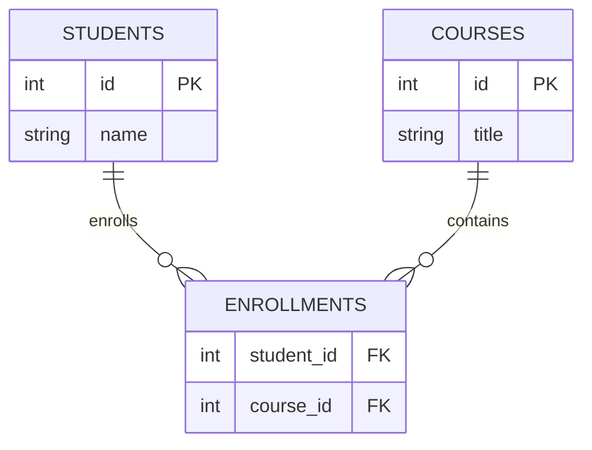

```mermaid
erDiagram
    STUDENTS {
        int id PK
        string name
    }
    
    COURSES {
        int id PK
        string title
    }
    
    ENROLLMENTS {
        int student_id FK
        int course_id FK
    }
    
    STUDENTS ||--o{ ENROLLMENTS : enrolls
    COURSES ||--o{ ENROLLMENTS : contains

```